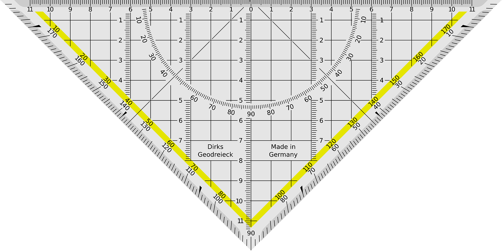
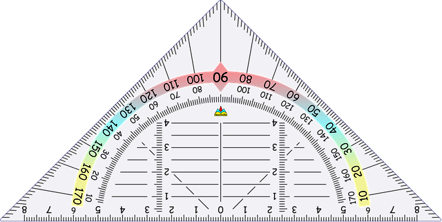

# Image test gallery

This document contains several image references using files from the `tests/images` directory.

# Ruler Image with Title

# Triangle PNG

# Another Triangle PNG

# Online images

# Inline Image Test
Inline image: This is an inline image  within a sentence.

# SVG Image

End of gallery.
