## 1. Simple Flow
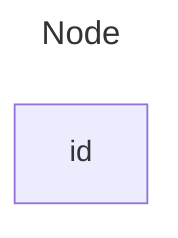
```mermaid
---
title: Node
---
flowchart LR
    id
```

## 2. Left-to-right
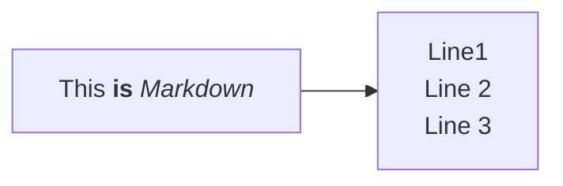
```mermaid
---
config:
  flowchart:
    htmlLabels: false
---
flowchart LR
    markdown["`This **is** _Markdown_`"]
    newLines["`Line1
    Line 2
    Line 3`"]
    markdown --> newLines
```

## 3. Sequence
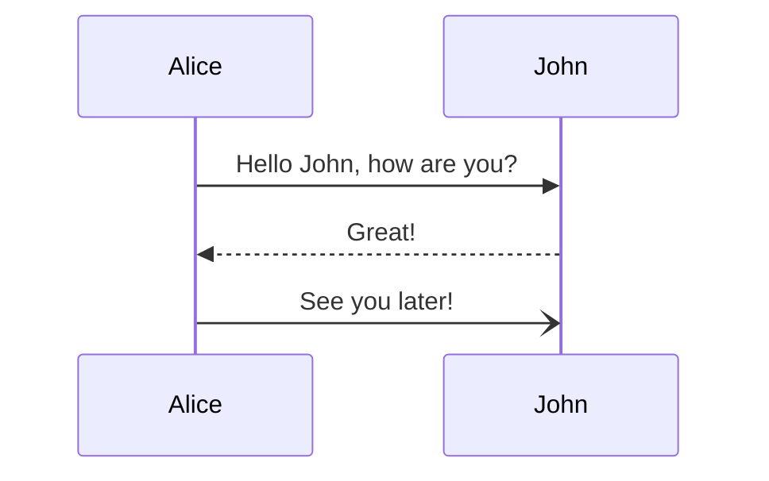
```mermaid
sequenceDiagram
    Alice->>John: Hello John, how are you?
    John-->>Alice: Great!
    Alice-)John: See you later!
```

## 4. Class
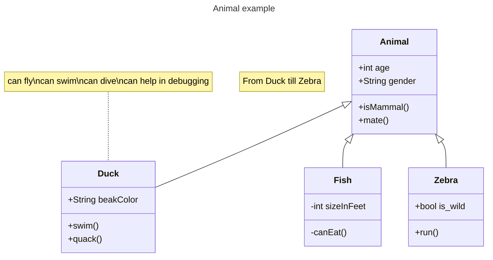
```mermaid
---
title: Animal example
---
classDiagram
    note "From Duck till Zebra"
    Animal <|-- Duck
    note for Duck "can fly\ncan swim\ncan dive\ncan help in debugging"
    Animal <|-- Fish
    Animal <|-- Zebra
    Animal : +int age
    Animal : +String gender
    Animal: +isMammal()
    Animal: +mate()
    class Duck{
        +String beakColor
        +swim()
        +quack()
    }
    class Fish{
        -int sizeInFeet
        -canEat()
    }
    class Zebra{
        +bool is_wild
        +run()
    }
```

## 5. State
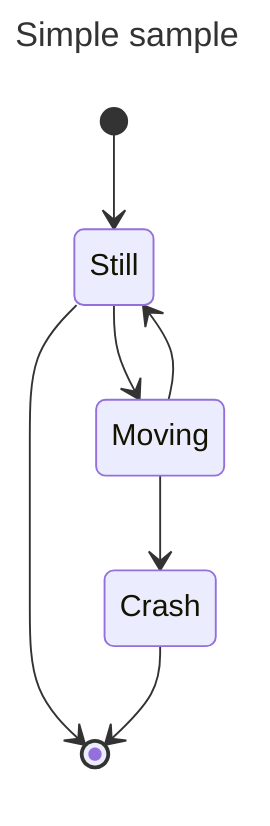
```mermaid
---
title: Simple sample
---
stateDiagram-v2
    [*] --> Still
    Still --> [*]

    Still --> Moving
    Moving --> Still
    Moving --> Crash
    Crash --> [*]
```

## 6. Pie
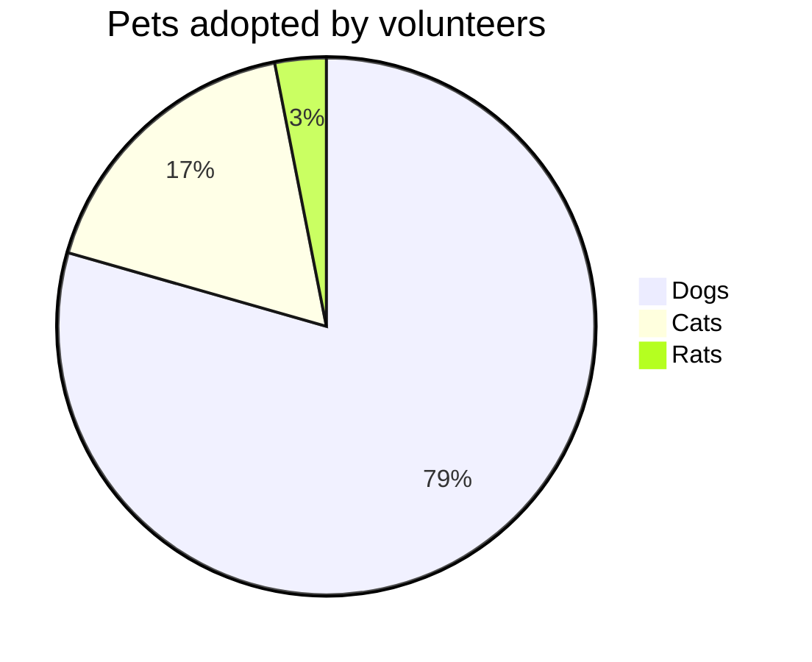
```mermaid
pie title Pets adopted by volunteers
    "Dogs" : 386
    "Cats" : 85
    "Rats" : 15
```

## 7. Gantt
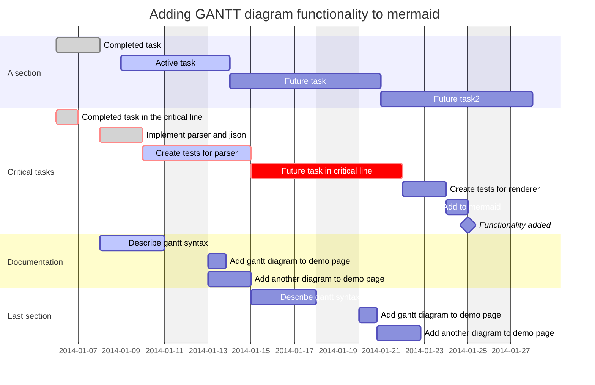
```mermaid
gantt
    dateFormat  YYYY-MM-DD
    title       Adding GANTT diagram functionality to mermaid
    excludes    weekends

    section A section
    Completed task            :done,    des1, 2014-01-06,2014-01-08
    Active task               :active,  des2, 2014-01-09, 3d
    Future task               :         des3, after des2, 5d
    Future task2              :         des4, after des3, 5d

    section Critical tasks
    Completed task in the critical line :crit, done, 2014-01-06,24h
    Implement parser and jison          :crit, done, after des1, 2d
    Create tests for parser             :crit, active, 3d
    Future task in critical line        :crit, 5d
    Create tests for renderer           :2d
    Add to mermaid                      :until isadded
    Functionality added                 :milestone, isadded, 2014-01-25, 0d

    section Documentation
    Describe gantt syntax               :active, a1, after des1, 3d
    Add gantt diagram to demo page      :after a1  , 20h
    Add another diagram to demo page    :doc1, after a1  , 48h

    section Last section
    Describe gantt syntax               :after doc1, 3d
    Add gantt diagram to demo page      :20h
    Add another diagram to demo page    :48h
```

## 8. Mindmap
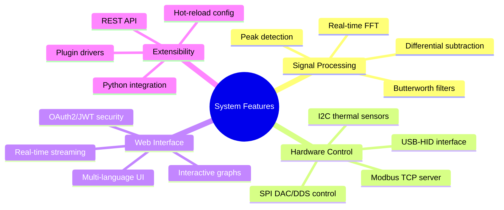
```mermaid
mindmap
  root((System Features))
    Signal Processing
      Real-time FFT
      Butterworth filters
      Differential subtraction
      Peak detection
    Hardware Control
      USB-HID interface
      I2C thermal sensors
      SPI DAC/DDS control
      Modbus TCP server
    Web Interface
      Real-time streaming
      OAuth2/JWT security
      Multi-language UI
      Interactive graphs
    Extensibility
      Python integration
      Plugin drivers
      Hot-reload config
      REST API
```

## 9. Git graph
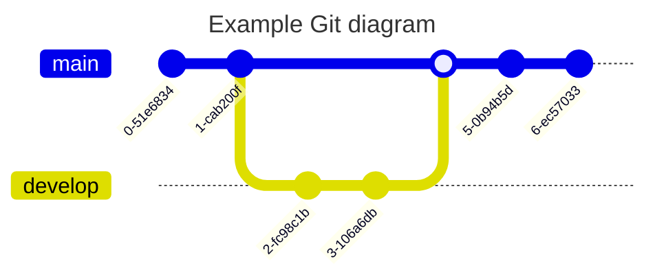
```mermaid
---
title: Example Git diagram
---
gitGraph
   commit
   commit
   branch develop
   checkout develop
   commit
   commit
   checkout main
   merge develop
   commit
   commit
```

## 10. Timeline
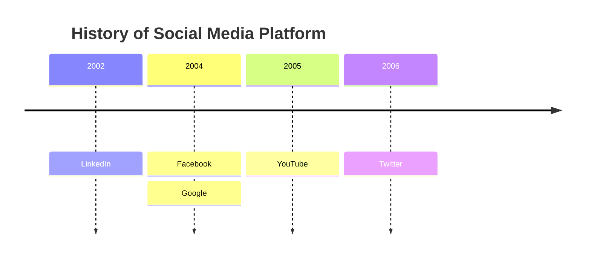
```mermaid
timeline
    title History of Social Media Platform
    2002 : LinkedIn
    2004 : Facebook
         : Google
    2005 : YouTube
    2006 : Twitter
```

## 11. AtMega32U4
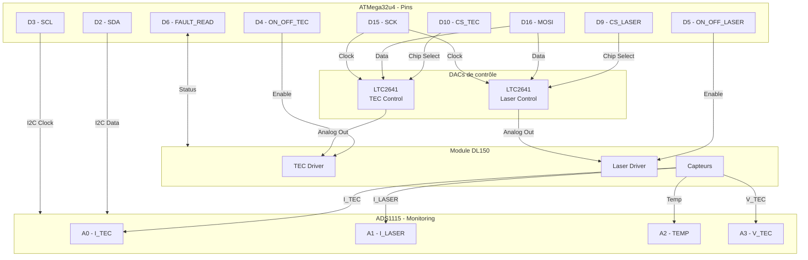
```mermaid
graph TB
    subgraph MCU["ATMega32u4 - Pins"]
        I2C_SDA["D2 - SDA"]
        I2C_SCL["D3 - SCL"]
        SPI_CS_TEC["D10 - CS_TEC"]
        SPI_CS_LASER["D9 - CS_LASER"]
        SPI_MOSI["D16 - MOSI"]
        SPI_SCK["D15 - SCK"]
        GPIO_TEC["D4 - ON_OFF_TEC"]
        GPIO_LASER["D5 - ON_OFF_LASER"]
        GPIO_FAULT["D6 - FAULT_READ"]
    end
  
    subgraph ADC["ADS1115 - Monitoring"]
        ADC_A0["A0 - I_TEC"]
        ADC_A1["A1 - I_LASER"]
        ADC_A2["A2 - TEMP"]
        ADC_A3["A3 - V_TEC"]
    end
  
    subgraph DAC["DACs de contrôle"]
        DAC_TEC["LTC2641<br/>TEC Control"]
        DAC_LASER["LTC2641<br/>Laser Control"]
    end
  
    subgraph DL150["Module DL150"]
        TEC["TEC Driver"]
        LASER["Laser Driver"]
        SENS["Capteurs"]
    end
  
    I2C_SDA -->|"I2C Data"| ADC
    I2C_SCL -->|"I2C Clock"| ADC
  
    SPI_CS_TEC -->|"Chip Select"| DAC_TEC
    SPI_CS_LASER -->|"Chip Select"| DAC_LASER
    SPI_MOSI -->|"Data"| DAC_TEC
    SPI_MOSI -->|"Data"| DAC_LASER
    SPI_SCK -->|"Clock"| DAC_TEC
    SPI_SCK -->|"Clock"| DAC_LASER
  
    GPIO_TEC -->|"Enable"| TEC
    GPIO_LASER -->|"Enable"| LASER
    GPIO_FAULT <-->|"Status"| DL150
  
    DAC_TEC -->|"Analog Out"| TEC
    DAC_LASER -->|"Analog Out"| LASER
  
    SENS -->|"I_TEC"| ADC_A0
    SENS -->|"I_LASER"| ADC_A1
    SENS -->|"Temp"| ADC_A2
    SENS -->|"V_TEC"| ADC_A3
```
